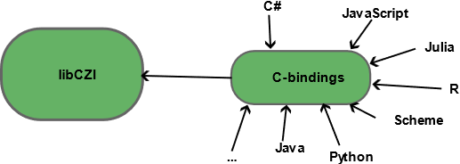

libCZI API
==========

The main goal is to support bindings for more languages and language-ecosystems.
The C-API itself acts as a bridge between the native (C++) implementation of libCZI and other languages that can establish a foreign-function interface based on a shared library that contains C-style (without name mangling etc.) function definitions. libCZI opens up for arbitrary interfacing languages in that way.

It features:
	- Reading and writing metadata.
	- Reading and writing image data (subblocks).
	- Reading subblocks which are compressed with JPEG, JPEG-XR and ZStd.
	- Reading and writing attachments.
	- Works with tiled images and pyramid images.
	- Composing multi-channel images with tinting and gradation curves.

General Overview
----------------
At its core, the architecture consists of three main components:

1. libCZI (C++): This is the native implementation of the libCZI (you can find more detail in the :doc:`libCZI  documentation <../mainpage.rst>`), written in C++. It contains the core functionalities and performance-critical components of the library.

2. libCZI-API (C++): Acting as a bridge, the API layer exposes the functionalities of the libCZI to other, external languages. This layer translates calls from external languages into corresponding calls to the native C++ functions.

3. External Language Bindings: This layer consists of bindings for various external languages such as C#, Python, Java, and others. These bindings allow developers to interact with the libCZI API using the syntax and idioms of their chosen language.

Versioning of API
^^^^^^^^^^^^^^^^^
To ensure consistency and reliability, the libCZI API uses semantic versioning scheme 2.0. This approach provides a structured method for version control, allowing developers to understand the nature of changes and updates made to the API. The version number is meticulously maintained in the top-level VersionNumber.txt file, which serves as the definitive source for the API's version information. It is crucial that any modifications to the API are accompanied by an appropriate update to this version number, reflecting the scope and impact of the changes.
The version statement allows for four numbers: ``<major>.<minor>.<patch>.<tweak>``. The number for ``<tweak>`` has no semantic meaning.

Errors Codes in LibCZI API
^^^^^^^^^^^^^^^^^^^^^^^^^^
Each function in the API returns an LibCZIApiErrorCode. In general, values greater than zero indicate an error condition; and values less or equal to zero indicate proper operation.
You can find all error codes below:

+-------------------------------------------+-------------------------------------------+
| Error                                     | Description                               |
+===========================================+===========================================+
| LibCZIApi_ErrorCode_OK                    | The operation completed successfully.     |
+-------------------------------------------+-------------------------------------------+
| LibCZIApi_ErrorCode_InvalidArgument       | An invalid argument was supplied to the   |
|                                           | function.                                 |
+-------------------------------------------+-------------------------------------------+
| LibCZIApi_ErrorCode_InvalidHandle         | An invalid handle was supplied to the     |
|                                           | function (i.e., a handle which is either  |
|                                           | a bogus value or a handle which has       |
|                                           | already been destroyed).                  |
+-------------------------------------------+-------------------------------------------+
| LibCZIApi_ErrorCode_OutOfMemory           | The operation failed due to an            |
|                                           | out-of-memory condition.                  |
+-------------------------------------------+-------------------------------------------+
| LibCZIApi_ErrorCode_IndexOutOfRange       | A supplied index was out of range.        |
+-------------------------------------------+-------------------------------------------+
| LibCZIApi_ErrorCode_UnspecifiedError      | An unspecified error occurred.            |
+-------------------------------------------+-------------------------------------------+
