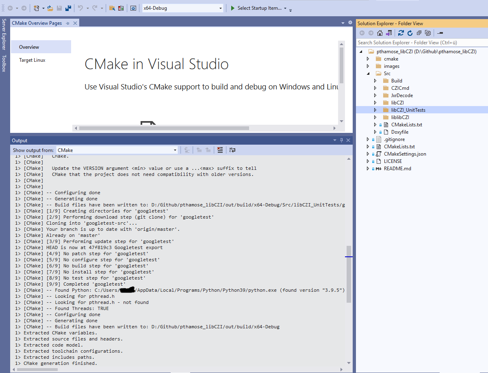

Building libCZI
===============

libCZI aims to be portable and should build readily using any decent C++ compiler. This repository is leveraging the `CMake <https://cmake.org/>`_ system for building.

Here are some instructions for building on Windows and on Linux.

Building on Windows with Visual Studio
--------------------------------------

Visual Studio has `built-in support <https://docs.microsoft.com/en-us/cpp/build/cmake-projects-in-visual-studio?view=msvc-160>`_ for CMake projects. Executing File->Open Folder... and pointing to the folder where the libCZI-repo is located should give something like this:

The project should compile and build without further ado.

For building on the command-line, it is recommended to do an out-of-source build. Executing those commands will execute all steps - go to the folder where the libCZI-repo is located:

.. code:: bash

    mkdir build
    cd build
    cmake ..
    cmake --build .

Building on Linux
-----------------

The same steps as above will build the code - go into the folder where the libCZI-repo is located, and run

.. code:: bash

    mkdir build
    cd build
    cmake ..
    cmake --build .

Configurations
--------------

The CMake-file defines the following options for customizing the build:

+----------------------------------+----------------------------------+
| option                           | description                      |
+==================================+==================================+
| LIBCZI\_BUILDUNITTESTS           | Whether to build the unit-tests  |
|                                  | for libCZI. Default is **ON**.   |
+----------------------------------+----------------------------------+
| LIBCZI\_BUILDCZICMD              | Whether to build the test- and   |
|                                  | sample-application CZICmd.       |
|                                  | Default is **OFF**.              |
+----------------------------------+----------------------------------+
| LIBCZI\_BUILDDYNLIB              | Whether to build the dynamic     |
|                                  | link libaray for libczi. Default |
|                                  | is **ON**.                       |
+----------------------------------+----------------------------------+
| LIBCZI\_BUILD                    | Whether to use an existing       |
| PREFEREXTERNALPACKAGEEIGEN3      | Eigen3-library on the system     |
|                                  | (included via                    |
|                                  | find_package). If this           |
|                                  | is OFF, then a copy of Eigen3 is |
|                                  | downloaded as part of the build. |
|                                  | Default is **OFF**.              |
+----------------------------------+----------------------------------+
| LIBCZI\_                         | Whether to use an existing       |
| BUILDPREFEREXTERNALPACKAGEZSTD   | zstd-library on the system       |
|                                  | (included via                    |
|                                  | find_package). If this           |
|                                  | is OFF, then a copy of zstd is   |
|                                  | downloaded as part of the build. |
|                                  | Default is **OFF**.              |
+----------------------------------+----------------------------------+
| LIBCZI\                          | Whether a curl-based stream      |
| BUILDCURLBASEDSTREAM             | object should be built (and be   |
|                                  | available in the stream          |
|                                  | factory). Default is **OFF**.    |
+----------------------------------+----------------------------------+
| LIBCZI\_BUILD                    | Whether to use an existing       |
| PREFEREXTERNALPACKAGELIBCURL     | libcurl-library on the system    |
|                                  | (included via                    |
|                                  | find_package). If this           |
|                                  | is OFF, then a copy of libcurl   |
|                                  | is downloaded as part of the     |
|                                  | build. Default is **OFF**.       |
+----------------------------------+----------------------------------+
| LIBCZI\_                         | Whether the Azure-SDK-based      |
| BUILDAZURESDKBASEDSTREAM         | stream object should be built    |
|                                  | (and be available in the stream  |
|                                  | factory). Default is **OFF**.    |
+----------------------------------+----------------------------------+

If building CZICmd is desired, then running CMake with this command line will enable building CZICmd:

.. code:: bash
    
    cmake .. -DLIBCZI_BUILD_CZICMD=ON

Building CZICmd requires the external package RapidJSON to be available. In addition, on Linux the packages ZLIB, PNG and (optionally) Freetype are needed.

If necessary, they can be installed like this (assuming a Debian based distro):

.. code:: bash

   sudo apt-get install zlib1g-dev
   sudo apt-get install libpng-dev
   sudo apt-get install rapidjson-dev
   sudo apt-get install libfreetype6-dev

For building with a downloaded libcurl, the following packages is needed:

.. code:: bash

    sudo apt-get install libssl-dev

Alternatively, the cross-platform package-manager `vcpkg <https://vcpkg.io/en/>`_ can be used to manage the dependencies. For building on Windows,
the following command brings in the necessary dependencies:

.. code:: bash
          
    vcpkg install rapidjson 'curl[ssl]'

Building the documentation
--------------------------

Executing <tt>doxygen</tt> will produce the HTML documentation in the folder ../Src/Build folder.

