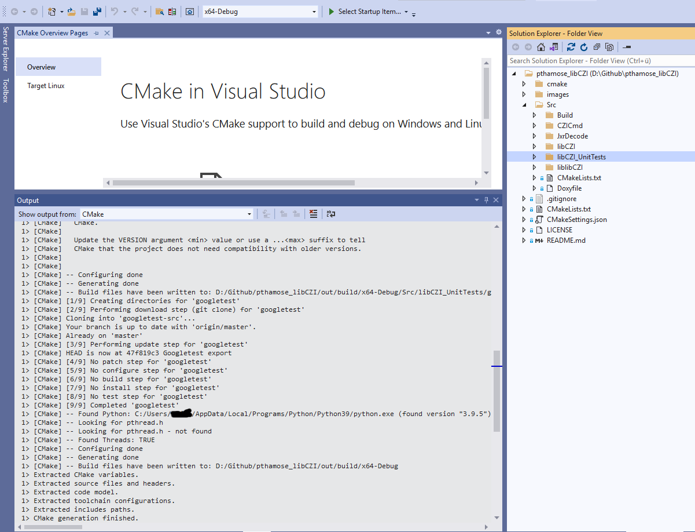

Building libCZI
===============

libCZI aims to be portable and should build readily using any decent C++ compiler. This repository is leveraging the `CMake <https://cmake.org/>`_ system for building.

Here are some instructions for building on Windows and on Linux.

Building on Windows with Visual Studio
--------------------------------------

Visual Studio has `built-in support <https://docs.microsoft.com/en-us/cpp/build/cmake-projects-in-visual-studio?view=msvc-160>`_ for CMake projects. Executing File->Open Folder... and pointing to the folder where the libCZI-repo is located should give something like this:

The project should compile and build without further ado.

For building on the command-line, it is recommended to do an out-of-source build. Executing those commands will execute all steps - go to the folder where the libCZI-repo is located:

.. code:: bash

    mkdir build
    cd build
    cmake ..
    cmake --build .

Building on Linux
-----------------

The same steps as above will build the code - go into the folder where the libCZI-repo is located, and run

.. code:: bash

    mkdir build
    cd build
    cmake ..
    cmake --build .

Configurations
--------------

The CMake-file defines the following options for customizing the build:

+----------------------------------+----------------------------------+
| option                           | description                      |
+==================================+==================================+
| LIBCZI\_BUILD\_UNITTESTS         | Whether to build the unit-tests  |
|                                  | for libCZI. Default is **ON**.   |
+----------------------------------+----------------------------------+
| LIBCZI\_BUILD\_CZICMD            | Whether to build the test- and   |
|                                  | sample-application CZICmd.       |
|                                  | Default is **OFF**.              |
+----------------------------------+----------------------------------+
| LIBCZI\_BUILD\_DYNLIB            | Whether to build the dynamic     |
|                                  | link libaray for libczi. Default |
|                                  | is **ON**.                       |
+----------------------------------+----------------------------------+
| LIBCZI\_BUILD\_                  | Whether to use an existing       |
| PREFER\_EXTERNALPACKAGE\_EIGEN3  | Eigen3-library on the system     |
|                                  | (included via                    |
|                                  | find_package). If this           |
|                                  | is OFF, then a copy of Eigen3 is |
|                                  | downloaded as part of the build. |
|                                  | Default is **OFF**.              |
+----------------------------------+----------------------------------+
| LIBCZI\_BUILD\_                  | Whether to use an existing       |
| PREFER\_EXTERNALPACKAGE\_ZSTD    | zstd-library on the system       |
|                                  | (included via                    |
|                                  | find_package). If this           |
|                                  | is OFF, then a copy of zstd is   |
|                                  | downloaded as part of the build. |
|                                  | Default is **OFF**.              |
+----------------------------------+----------------------------------+
| LIBCZI\                          | Whether a curl-based stream      |
| BUILD\_CURL\_BASED\_STREAM       | object should be built (and be   |
|                                  | available in the stream          |
|                                  | factory). Default is **OFF**.    |
+----------------------------------+----------------------------------+
| LIBCZI\_BUILD                    | Whether to use an existing       |
| PREFER\_EXTERNAL\_PACKAGE\_      | libcurl-library on the system    |
| LIBCURL                          | (included via                    |
|                                  | find_package). If this           |
|                                  | is OFF, then a copy of libcurl   |
|                                  | is downloaded as part of the     |
|                                  | build. Default is **OFF**.       |
+----------------------------------+----------------------------------+
| LIBCZI\_                         | Whether the Azure-SDK-based      |
| BUILD\_AZURESDK\_BASED\_STREAM   | stream object should be built    |
|                                  | (and be available in the stream  |
|                                  | factory). Default is **OFF**.    |
+----------------------------------+----------------------------------+
| LIBCZI\_BUILD\_                  | Prefer a RapidJSON-package       |
| PREFER\_EXTERNALPACKAGE\_        | present on the system.  Default  |
| RAPIDJSON                        | is **ON**                        |
+----------------------------------+----------------------------------+
| LIBCZI\_BUILD\_LIBCZIAPI         | Build the **C** API bridge       |
|                                  | which can be used as foreign     |
|                                  | function interface between other |
|                                  | languages.  Default is **OFF**   |
+----------------------------------+----------------------------------+

Experimental functionality
--------------------------

Experimental functionality is disabled by default unless explicitly enabled.
The global option ``LIBCZI_BUILD_ENABLE_EXPERIMENTAL_FUNCTIONALITY`` accepts the
values ``AUTO``, ``ON`` and ``OFF``. ``AUTO`` is the default and keeps the
conservative build behavior.

Individual experimental features can also be controlled directly. The
experimental chunked-compression feature is enabled with:

.. code:: bash

    cmake .. -DLIBCZI_BUILD_EXPERIMENTAL_CHUNKED_COMPRESSION=ON

When this feature is enabled, the public configuration header defines
``LIBCZI_EXPERIMENTAL_CHUNKED_COMPRESSION_AVAILABLE`` to ``1``. The feature may
also be enabled through the global experimental policy:

.. code:: bash

    cmake .. -DLIBCZI_BUILD_ENABLE_EXPERIMENTAL_FUNCTIONALITY=ON

If both the global policy and the feature-specific option are supplied, the
feature-specific option takes precedence. For more details about the feature and
its file format, see :doc:`chunked_compression`.

If building CZICmd is desired, then running CMake with this command line will enable building CZICmd:

.. code:: bash
    
    cmake .. -DLIBCZI_BUILD_CZICMD=ON

Building CZICmd requires the external package RapidJSON to be available. In addition, on Linux the packages ZLIB, PNG and (optionally) Freetype are needed.

If necessary, they can be installed like this (assuming a Debian based distro):

.. code:: bash

   sudo apt-get install zlib1g-dev
   sudo apt-get install libpng-dev
   sudo apt-get install rapidjson-dev
   sudo apt-get install libfreetype6-dev

For building with a downloaded libcurl, the following packages is needed:

.. code:: bash

    sudo apt-get install libssl-dev

Using vcpkg
-----------

Alternatively, the cross-platform package-manager `vcpkg <https://vcpkg.io/en/>`_
can be used to build and install libCZI. For example:

.. code:: bash

    vcpkg install libczi

Optional vcpkg features can be selected with the usual feature syntax:

.. code:: bash

    vcpkg install "libczi[curl]"

For building libCZI itself on Windows, vcpkg can also be used to bring in
dependencies such as RapidJSON and curl:

.. code:: bash
          
    vcpkg install rapidjson 'curl[ssl]'

Experimental functionality and overlay ports
--------------------------------------------

The vcpkg registry port for libCZI is intended to provide stable, generally
supported build configurations. Experimental libCZI features may be unsuitable
for the registry port while their API, ABI, file format, or dependencies are
still subject to change.

If you want to consume an experimental feature through vcpkg, use an overlay
port. An overlay port is a local copy of a vcpkg port that takes precedence over
the registry version for a single vcpkg invocation. This lets a project opt in to
experimental libCZI build switches without requiring those switches to be part of
the public vcpkg registry.

A typical workflow is:

.. code:: bash

    mkdir -p vcpkg-overlays/ports
    cp -r <vcpkg-root>/ports/libczi vcpkg-overlays/ports/libczi

Then edit the copied ``vcpkg-overlays/ports/libczi`` port to expose the desired
feature and map it to the corresponding libCZI CMake options. For experimental
chunked compression, the relevant options are:

.. code:: cmake

    LIBCZI_BUILD_ENABLE_EXPERIMENTAL_FUNCTIONALITY
    LIBCZI_BUILD_EXPERIMENTAL_CHUNKED_COMPRESSION
    LIBCZI_BUILD_PREFER_EXTERNALPACKAGE_LZ4

The overlay port should also declare the additional dependency on ``lz4``. It
can then be used with:

.. code:: bash

    vcpkg install "libczi[experimental-chunked-compression]" \
        --overlay-ports=./vcpkg-overlays/ports

Projects using overlay ports should treat the resulting binaries and CZI files
as experimental and keep the overlay definition under their own version control.

Building the documentation
--------------------------

Executing :code:`doxygen` will produce the HTML documentation in the folder ../Src/Build folder.

