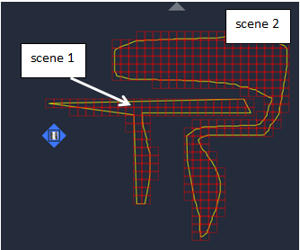
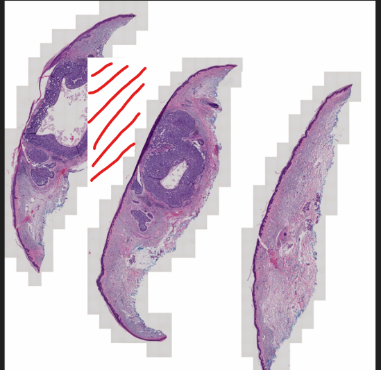
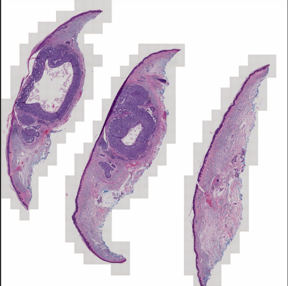

Valid-Pixel Mask Concept
========================

Introduction
------------

The term *valid-pixel mask* (or simply *mask*) refers to a binary bitmap that marks which pixels are in a sub-block are valid and which are not.
A sub-block in a CZI document is always rectangular and cannot directly indicate invalid pixels within the rectangle. Therefore, it is not
possible to represent non-rectangular images directly. The valid-pixel mask overcomes this limitation.

The concept is:

* An additional bitonal (i.e., 1 bit per pixel) bitmap is stored with each sub-block.
* A **zero** in this mask bitmap marks the corresponding pixel in the sub-block as **not valid**; a **one** marks the pixel as **valid**.
* For a multi-tile composition, non-valid pixels are not rendered.

Mask in pyramids
----------------

The immediate use case for this mask is with pyramids. In CZI, pyramids are constructed **per scene**, and the axis-aligned bounding boxes
of scenes may overlap—as shown here:

Although tiles of different scenes do not overlap, the scenes’ axis-aligned bounding boxes do. This means the pyramid tiles **overlap**,
and it is impossible to render a scene composite that contains the complete image data. The result looks like this:

Provide each scene’s pyramid tiles with a valid-pixel mask, and the composition then looks like this:

Data layout of the mask in CZI
------------------------------

In CZI, the mask is stored in the sub-block *attachment*. A sub-block consists of three parts: pixel data, metadata, and an attachment
(the latter two are optional). The attachment is a binary blob that can contain arbitrary data. Its format is specified in the metadata
of the sub-block.

The attachment format used for the mask is called ``CHUNKCONTAINER``. It subdivides the attachment into chunks; each chunk has a type (``GUID``)
and a length (``Int``). The mask is stored in a chunk of type ``VALIDPIXELMASK``.

The memory layout of a ``CHUNKCONTAINER`` is as follows:

.. list-table::
   :header-rows: 1
   :widths: 12 12 40

   * - Offset
     - Type
     - Purpose
   * - ``0``
     - GUID
     - Identifies the type of the payload
   * - ``16``
     - Int
     - Size of payload
   * - ``20 ... 20+size``
     - Byte[]
     - The first chunk (payload)
   * - ``20+size``
     - GUID
     - (Optionally) identifies the type of the next payload
   * - ``20+size+16``
     - Int
     - Size of payload
   * - ``20+size+20``
     - Byte[]
     - The second chunk (payload)

A chunk starts with a ``GUID`` that identifies the payload type, followed by an integer giving the size of the immediately following payload.
If there is a second chunk, it follows directly after the first payload (again: ``GUID``, size, payload).

The size of the container is implicitly known (the container occupies the attachment), and the total size is used to terminate chunk
enumeration. The last chunk has been reached when the computed offset of the *next* chunk is greater than or equal to the attachment size.
Enumeration proceeds as follows (assuming the total size is known):

#. Read chunk header (``GUID`` + ``Int`` size).
#. Compute the offset of the next chunk (current offset + ``20`` + payload size).
#. If the next offset ≥ total size of the attachment → stop.
#. Go to step 1.

The ``GUID`` that identifies the *ValidPixelMask* is :code:`{CBE3EA67-5BFC-492B-A16A-ECE378031448}`.

The payload layout of a *ValidPixelMask* chunk is:

.. list-table::
   :header-rows: 1
   :widths: 16 10 28 46

   * - Offset
     - Type
     - Name
     - Comment
   * - ``0``
     - Int
     - ``width``
     - Width, in pixels.
   * - ``4``
     - Int
     - ``height``
     - Height, in pixels.
   * - ``8``
     - Int
     - ``representation_type = 0``
     - The following layout applies only when ``representation_type = 0``.
   * - ``12``
     - Int
     - ``stride``
     - Line length in bytes.
   * - ``16 ... 16+stride-1``
     - Byte[]
     - First line of mask data (bitonal bitmap)
     - 
   * - ``(16+stride) ... (16 + stride * height - 1)``
     - Byte[]
     - Remaining lines of mask (up to ``height``)
     - 

In the bitonal bitmap representation, the leftmost pixel in each byte is the **most significant bit**, as depicted here:

.. image:: ../_static/images/memory_layout_bitonal_bitmap.png
   :alt: memory layout of a bitonal bitmap

Defining the attachment format in metadata
------------------------------------------

In the sub-block metadata, the attachment format is defined using the ``DataFormat`` element inside the ``AttachmentSchema`` section.
For a chunk container (which may contain a valid-pixel mask), the value **must** be ``CHUNKCONTAINER`` (case-sensitive):

.. code-block:: xml

   <METADATA>
     <AttachmentSchema>
       <DataFormat>CHUNKCONTAINER</DataFormat>
     </AttachmentSchema>
   </METADATA>

Mask-support in libCZI
----------------------

libCZI has support for accessing the valid-pixel mask of a sub-block. And the compositors are capable of using the mask when rendering multi-tile compositions.

E.g., for the ``ISingleChannelTileAccessor`` interface, in the respective ``Options`` structure, mask support can be enabled by setting the ``maskAware`` member to true. If
the sub-blocks have a valid-pixel mask, it will be used when rendering the tile. Note that ``maskAware`` is false by default, so mask support must be explicitly enabled.   
Operation with a sub-block cache is also supported. However, there is one subtlety: If a sub-block is cached (by a render-operation of the accessor), the mask is only
cached if ``maskAware`` is true (for this operation). If ``maskAware`` is false, the sub-block is cached without the mask. If later a render-operation is performed with ``maskAware`` set to true,
the sub-block (from cache) is treated as if it has no mask.

Resolution protocol for ill-formed masks
----------------------------------------

The mask has to have the same width and height as the sub-block it belongs to. If this is not the case, libCZI applies the following protocol:

1. **Mask is larger than bitmap**: The surplus pixels are ignored (cropped).

2. **Mask is smaller than bitmap**: The mask is expanded by adding non-valid pixels (zeros) to the right and/or bottom.

Note that a mask is strictly optional. If no mask is present, the sub-block is treated as "all pixels are valid".

