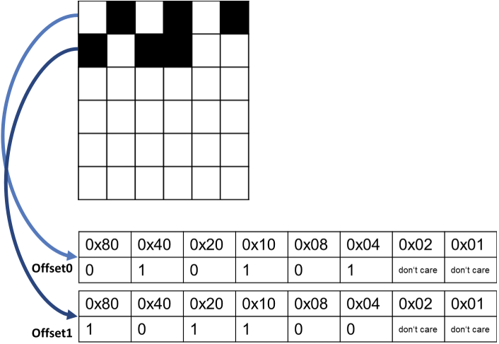

Valid-Pixel-Mask Concept
========================

Introduction
------------

With the term *valid-pixel-mask* (or *mask* for short) we refer to a binary mask which indicates which pixels in a sub-block are valid and which are not. 
Basically, a sub-block in a CZI document is a rectangular image, and there is no way to indicate that some pixels in that rectangle are not valid. It is
therefore not possible to represent non-rectangular images directly. The valid-pixel-mask is a way to overcome this limitation.   
The concept is:

* An additional bitonal (i.e. 1 bit per pixel) bitmap is stored with each sub-block.
* A **zero** in this mask bitmap marks the corresponding pixel in the sub-block as **not valid**, a **one** declares the pixel as **valid**.
* For a multi-tile composition, non-valid pixels are not rendered.

Mask in Pyramids
----------------

The immediate use-case for this mask-concept is with pyramids. With CZI, pyramids are constructed **per scene**, and the axis-aligned bounding-box of scenes may be overlapping - as shown here: 

.. image:: ../_static/images/overlapping_scenes.jpg
   :alt: overlapping scenes

Although the tiles of different scenes are not overlapping, the axis-aligned bounding-boxes of the scenes evidently are. This means that pyramid-tiles **are overlapping**, and it is then impossible to render a scene-composite which would give the complete image data. The result is then a composition like this: 

.. image:: ../_static/images/scene-composite-wo_mask.png
   :alt: composition without mask

Therefore, the pyramid-tiles of each scene can be provided with a valid-pixel-mask, and the composition then looks like this:

.. image:: ../_static/images/scene-composite-w_mask.png
   :alt: composition with mask

Data-Layout of Mask in CZI
--------------------------

At CZI-level, the mask is stored in the *attachment* of a sub-block. Reminder: a subblock is constituted by three parts: the pixel-data, the metadata and the attachment (where the latter two are optional).   
The attachment is a binary blob which can contain arbitrary data. The format of the attachment is specified in the metadata of the sub-block.   
The attachment format in which the mask is stored is called **CHUNKCONTAINER**. It is a mechanism to subdivide the attachment blob into chunks, where each chunk has a type and a length. The mask is then stored in a chunk of type **VALIDPIXELMASK**.

The memory layout of a **CHUNKCONTAINER** is as follows:

.. list-table::
   :header-rows: 1
   :widths: 12 12 40

   * - Offset
     - Type
     - Purpose
   * - 0
     - Guid
     - Identifies the type of the payload
   * - 16
     - Int
     - Size of payload
   * - 20...20+size
     - Byte[]
     - The first chunk (payload)
   * - 20+size
     - Guid
     - (optionally) identifies the type of the (next) payload
   * - 20+size+16
     - Int
     - Size of payload
   * - 20+size+20
     - Byte[]
     - The second chunk (payload)

A chunk starts with a Guid which uniquely identifies what kind of data is to be found at the payload-section. The Guid is followed by an integer which gives 
the size of the payload that immediately follows. If there is a second chunk in the chunk-container, it will immediately follow after the payload 
(with its Guid, size and payload).   
The size of the chunk-container is implictly given (because it is put into an attachment section), and the total size of the chunk-container is used to terminate 
the search for a new chunk. That is, the last chunk has been found if the offset pointed to by its size-field is greater or equal than the size of the whole 
attachment. The steps to enumerate all chunks are therefore (under the precondition, that its total size is known):

#. Read chunk-header
#. Determine offset of next chunk
#. If offset of next chunk ≥ total size of attachment → stop
#. Goto step 1

The Guid which identifies the *ValidPixelMask* is: :code:`{CBE3EA67-5BFC-492B-A16A-ECE378031448}`.   
The memory layout of the payload of a *ValidPixelMask* chunk is as follows:

.. list-table::
   :header-rows: 1
   :widths: 16 10 28 46

   * - Offset
     - Type
     - Name
     - Comment
   * - ``0``
     - Int
     - ``width``
     - The width (specified in pixels).
   * - ``4``
     - Int
     - ``height``
     - The height (specified in pixels).
   * - ``8``
     - Int
     - ``Type of representation = 0``
     - The following is only valid for “type of representation = 0”
   * - ``12``
     - Int
     - ``Stride``
     - Length of a line specified in bytes.
   * - ``16...16+stride-1``
     - Byte[]
     - (first line of) mask data in bitmap representation
     - 
   * - ``(16+stride) ... (16 + stride * height - 1)``
     - Byte[]
     - (second to ``height``) lines of mask
     - 

The bitonal bitmap representation uses a scheme where the leftmost pixel in a byte is the most significant bit, as depicted here:

In the sub-block metadata, the attachment format is defined with the element DataFormat in the XML-section ``<AttachmentSchema>``. The value for a chunk-container (which
in turn may contain a valid-pixel-mask) is ``CHUNKCONTAINER``.

.. code-block:: xml

   <METADATA>
     <AttachmentSchema>
       <DataFormat>CHUNKCONTAINER</DataFormat>
     </AttachmentSchema>
   </METADATA>
